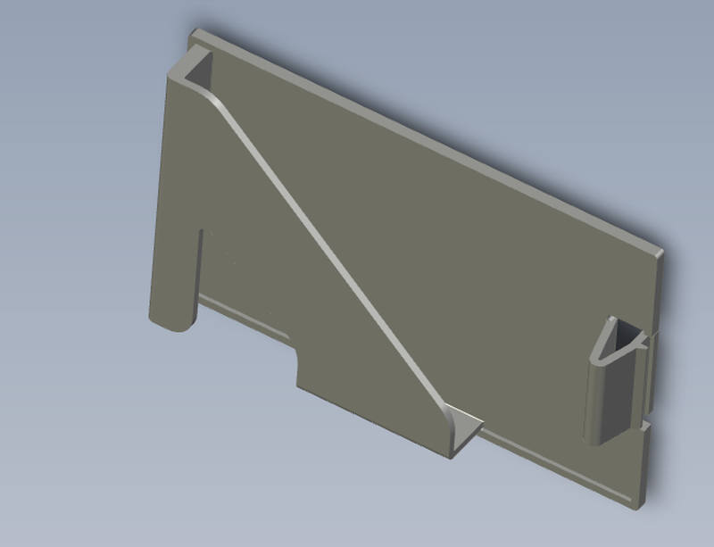
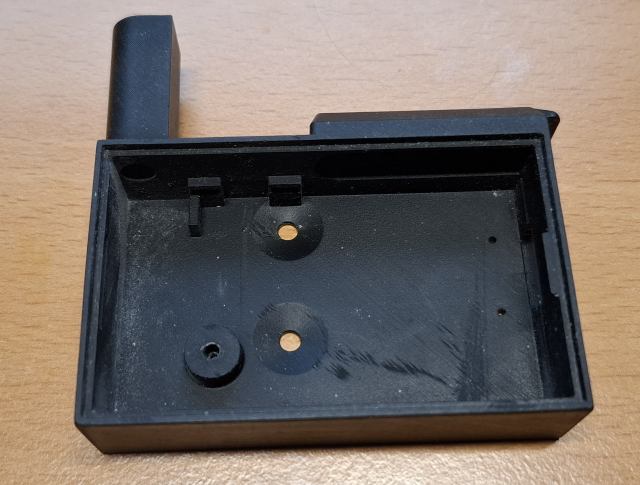
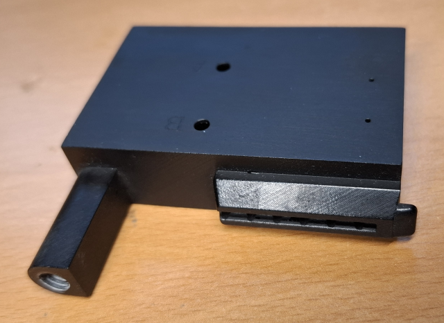
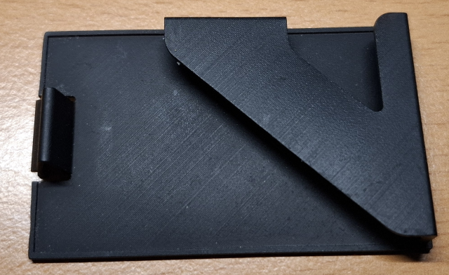
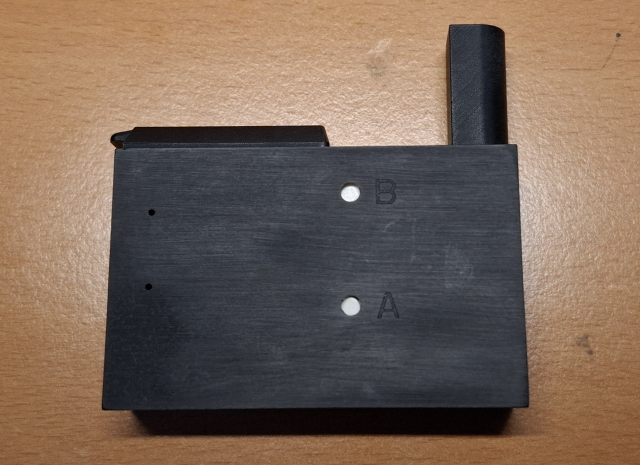
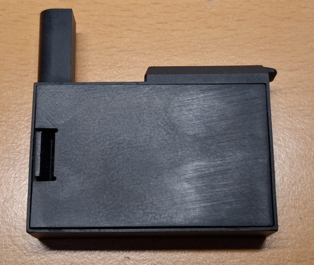
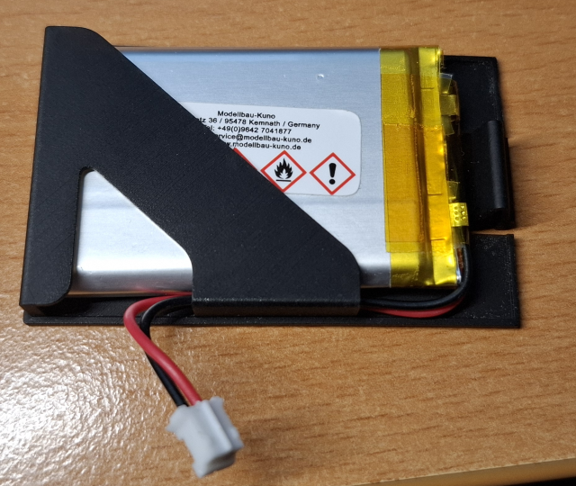
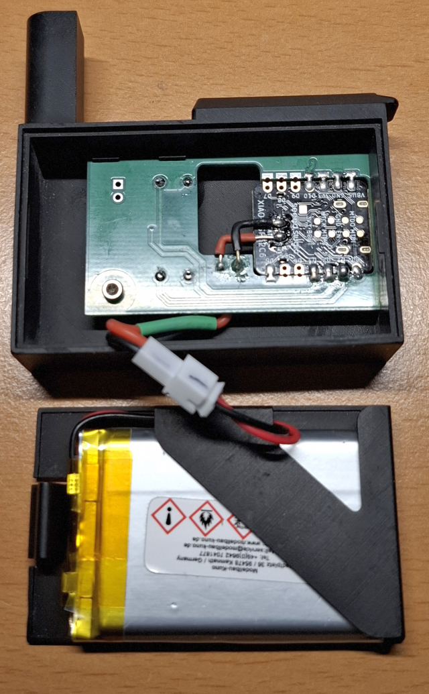

<!-- translation-source: README.md -->
<!-- translation-source-blob: 15a1c2b6c1e6d2231b8d28c124cf88ab9be56a50 -->

# Housing Files for 3D Printing

[Wechsel zu Deutsch](README.md)

## CAD files

CAD files for PTC Creo Parametrics v11.x: [Creo_parametrics/](./Creo_parametrics/)

## STEP files

- Housing: [gasmeter-case01.stp](./gasmeter-case01.stp)
- Battery cover: [battcover.stp](./battcover.stp)

## Images

Space for the PCB and reed switch:

(Cut an M6 thread in the “dome”; mount the board with an M2x10 hex socket screw)

Space for battery 523450 — 3.7 V / 1000 mAh (5.2 × 34 × 50 mm):

Printed at JLCPCB

| Item | Data |
| ---- | ---- |
| 3D Technology | SLA(Resin) |
| Material | JLC Black Resin |
| Colors | Black |
| Surface Finish | 01 Sanding / General Sanding |

Images

