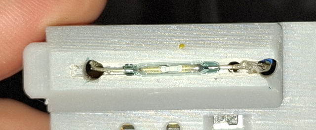

# Gas-O-Meter2 — KiCAD-Platinen

[Switch to English](README_EN.md)

KiCAD-Schaltpläne, Layouts und Stücklisten für die Hardware des Gas-O-Meter2 (ESP32-C6).

## Funktionsprinzip

Der Gaszähler-Takt wird mit einem **Reed-Schalter** erfasst. Der ESP32-C6 bietet keinen geeigneten **Schmitt-Trigger-Eingang** für saubere Impulserkennung — das kompensiert der **TPL5110**-Mikrotimer: Er entprellt den Reed-Schalter und erzeugt über den **8,2-kΩ-Widerstand** bei jedem Takt ein definiertes Signal von ca. **3,5 s** Länge.

## Reed-Ausrichtung im Gehäuse

Den Reed-Schalter in der vorgesehenen Aussparung des Gehäuses gemäß Bild ausrichten — so schließt der Magnet im Gaszähler zuverlässig:

## Platinenversionen

### [Version 20251022](Version20251022/README.md) — erste Revision

- Akku-Spannung am **GPIO0** (Pin1/A0/D0) mittels **1:1-Spannungsteiler** (R2/R3)
- **USB-Spannungsversorgung** durch **ADC-Heuristik** (kein dedizierter VBUS-Pin)

### [Version 20260523](Version20260523/README.md) — zweite Revision

- Akku-Spannung am **GPIO0** (Pin1/A0/D0) mittels **1:1-Spannungsteiler** (R2/R3)
- **USB-Spannungsversorgung:** **VBUS** an **GPIO18** (Pin11/D10) über **asymmetrischen Spannungsteiler** (R3/R4)
- **Freiraum** um die Onboard-Antenne zur Verbesserung der Sende-/Empfangseigenschaften
