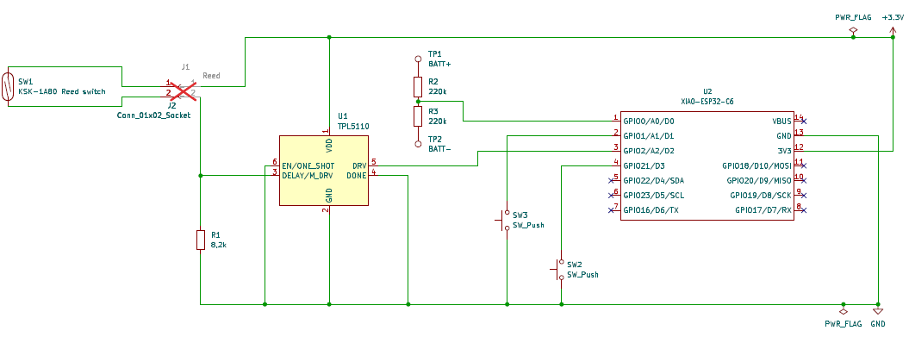
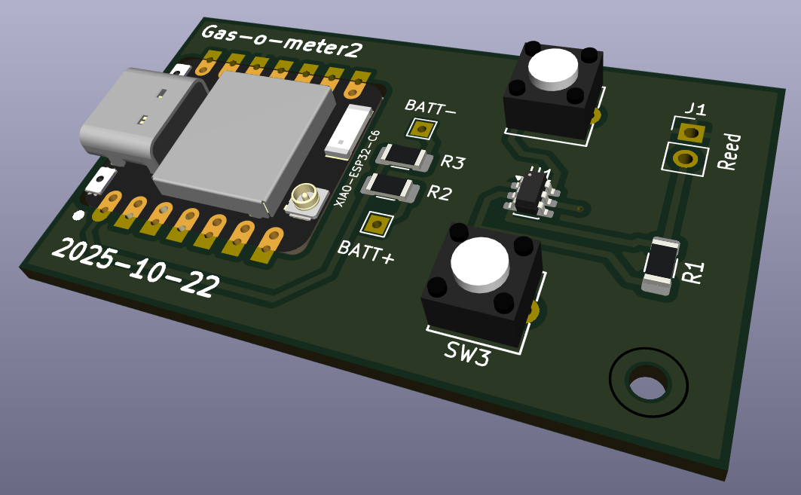

[↓ Switch to English](README_EN.md)

# Gas-O-Meter2 — Platinenversion 20251022

KiCAD-Projekt und Stückliste (BOM) der ersten Platinenrevision.

- Akku-Spannung am **GPIO0** (Pin1/A0/D0) mittels **1:1-Spannungsteiler** (R2/R3)
- **USB-Spannungsversorgung** durch **ADC-Heuristik** (Batteriespannung unter 2,0 V; kein VBUS-Pin)

## Schaltplan

[ESP32C6_gasometer (PDF)](ESP32C6_gasometer.pdf)

## Stückliste (BOM)

Quelle: `BOM_ESP32C6_gasometer.xlsx`

| Reference | Qty | Beschreibung | Value | Datasheet |
| --------- | --- | ------------ | ----- | --------- |
| J1 | 1 | Generic connector, single row, 01x02 // Reed | JST-XH 1.25 2pin socket | |
| J2 | 1 | Generic connector, single row, 01x02 // Reed | JST-XH 1.25 2pin plug | |
| R1 | 1 | Resistor_SMD1206 | 8,2k | |
| R2,R3 | 2 | Resistor_SMD1206 | 220k | |
| SW1 | 1 | reed switch | KSK-1A87-1520 | [Datasheet](https://standexdetect.de/wp-content/uploads/sites/8/2025/09/datasheet-reed-switch-series-ksk-1a80.pdf) |
| SW2,SW3 | 2 | Push button switch, generic, two pins | OMRON_B3F-6000 | [Datasheet](https://omronfs.omron.com/en_US/ecb/products/pdf/en-b3f.pdf) |
| U1 | 1 | Timer, Nano Power, SOT-23-6 | TPL5110 | [Datasheet](http://www.ti.com/lit/ds/symlink/tpl5110.pdf) |
| U2 | 1 | | Seeed Studio XIAO ESP32-C6 | |
| J3 | 1 | Generic connector, single row, 01x02 // Batterie | JST-PH 2.00 2pin socket | |
| | 1 | Li-Polymer Battery 52x34x5,0mm | LiPo 1000mAh 523450 | |

## 3D-Ansicht

## KiCAD-Export

Aktueller Stand: [ESP32C6_gasometer-2026-02-07_185848](ESP32C6_gasometer-2026-02-07_185848/)
