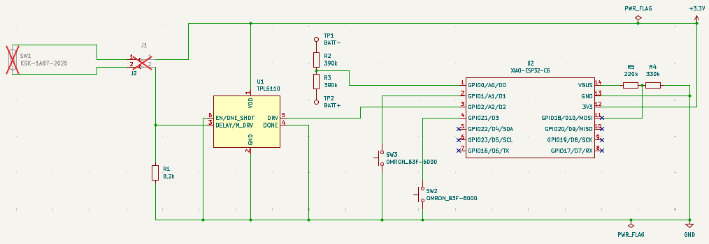
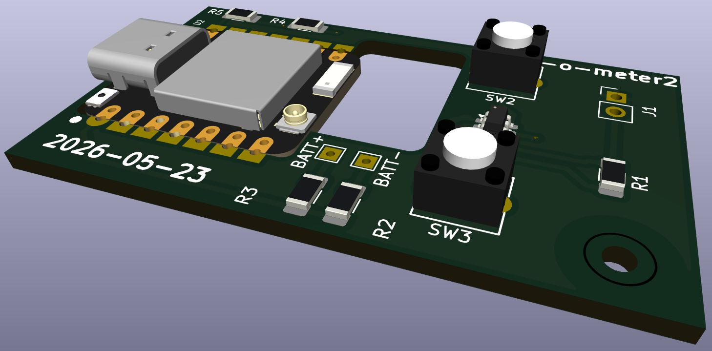

# Gas-O-Meter2 — Platinenversion 20260523

KiCAD-Projekt und Stückliste (BOM) der zweiten Platinenrevision.

- Akku-Spannung am **GPIO0** (Pin1/A0/D0) mittels **1:1-Spannungsteiler** (R2/R3)
- **USB-Spannungsversorgung:** **VBUS** an **GPIO18** (Pin11/D10) über **asymmetrischen Spannungsteiler** (R3/R4)
- **Freiraum** um die Onboard-Antenne zur Verbesserung der Sende-/Empfangseigenschaften

## Schaltplan

[Schaltplan ESP32C6_gasometer (PDF)](Schaltplan_ESP32C6_gasometer.pdf)

## Stückliste (BOM)

Quelle: `BOM_ESP32C6_gasometer.xlsx`

| Reference | Qty | Value | Beschreibung | Datasheet |
| --------- | --- | ----- | ------------ | --------- |
| J1 | 1 | JST-SH 1.25 2pin plug | Connector, single row, 01x02 | |
| J2 | 1 | JST-SH 1.25 2pin socket | Connector, single row, 01x02 | |
| R1 | 1 | 8,2k | Resistor_SMD1206 | |
| R2,R3 | 2 | 390k | Resistor_SMD1206 | |
| R4 | 1 | 330k | Resistor_SMD1206 | |
| R5 | 1 | 220k | Resistor_SMD1206 | |
| SW1 | 1 | KSK-1A87-2025 | reed switch | [Datasheet](https://standexdetect.de/wp-content/uploads/sites/8/2025/09/datasheet-reed-switch-series-ksk-1a80.pdf) |
| SW2,SW3 | 2 | OMRON_B3F-6000 | Push button switch, generic, two pins | [Datasheet](https://omronfs.omron.com/en_US/ecb/products/pdf/en-b3f.pdf) |
| U1 | 1 | TPL5110 | Timer, Nano Power, SOT-23-6 | [Datasheet](http://www.ti.com/lit/ds/symlink/tpl5110.pdf) |
| J3 | | JST-Conn. / Battery Connector | | |

## 3D-Ansicht

## KiCAD-Export

Aktueller Stand: `ESP32C6_gasometer-2026-07-11_162129`
