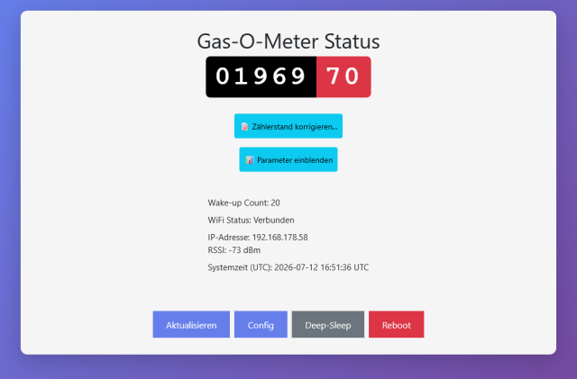
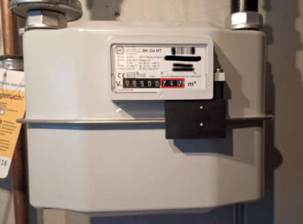

# Gas-O-Meter2

[](https://github.com/sneumeister/Gas-o-Meter2/releases)
[](./LICENSE)
[](https://www.espressif.com/en/products/socs/esp32-c6)
[](https://github.com/pioarduino/platform-espressif32)
[](https://docs.espressif.com/projects/esp-idf/)

ESP32-C6-basiertes Gaszähler-Monitoring mit **LP-Core Pulse-Counting**, akkubetriebenem Deep-Sleep und wählbaren Übertragungswegen (WiFi/MQTT, BLE, Zigbee).

Custom Carrier-PCB mit **TPL5110**-Mikrotimer für saubere Reed-Impulse, optionalem 3D-Druck-Gehäuse und Web-Interface zur Konfiguration.




## Features

- **TPL5110** — entprellt den Reed-Kontakt und liefert ein definiertes Zähler-Signal (~3,5 s); kompensiert den fehlenden Schmitt-Trigger-Eingang am ESP32-C6
- **LP-Core (ULP)** — Pulszählung im Low-Power-Core (`ulp/ulp_main.c`); der HP-Core ist nur bei Wake-up zur Datenübertragung aktiv
- **Deep-Sleep** — konfigurierbares Wake-up-Intervall über `wakeup_minutes` in der Config
- **NVS Ring-Buffer** — Sicherung des Zählerstands nur bei **Low-Akku** (< 30 % / < 3,57 V); bei Akku ≥ 30 % bleibt der Stand im RTC-RAM (auch bei USB/VBUS), um den Flash zu schonen
- **Web-Interface** — Status und Konfiguration über LittleFS (`data/index.html`, `config.html`); im **Dauerbetrieb** (Timer-Wake-up) nicht automatisch erreichbar
- **Taster A** — Web-UI und WiFi nur nach Wake-up über **Taster A** auf der Platine; bei reinem Timer-Wake-up erfolgt nur die Datenübertragung, danach sofort Deep-Sleep
- **Taster B** — derzeit **ohne Funktion**
- **Transfer-Modi** — `none`, `mqtt`, `ble` oder `zigbee` (jeweils ein Modus aktiv)

## Hardware

- **MCU:** [Seeed Studio XIAO ESP32-C6](https://wiki.seeedstudio.com/xiao_esp32c6_getting_started/) auf Custom Carrier-PCB
- **Sensorik:** Reed-Schalter für Gaszähler-Impulse, TPL5110, Akku- und USB-Erkennung
- **Dokumentation:**
  - [KiCAD-Platinen](KiCAD-PCB/README.md) — Schaltplan, BOM, 3D-Ansicht und Platinenversionen
  - [Gehäuse / 3D-Druck](CAD-housing/README.md) — STEP-Dateien, Creo-Quellen und Fotos

Die Firmware-Revision (`BOARD_VERSION_ID`, siehe [Build & Flash](#build--flash)) steuert nur die **USB-Erkennung**: Der Default `PCB_20251022` läuft auch auf der neuen Platine (Revision 20260523), nutzt dort aber die ADC-Heuristik statt VBUS an GPIO18. Für die dedizierte VBUS-Erkennung der zweiten Revision: `PCB_20260523`. Details zu den Platinen über die [KiCAD-Übersicht](KiCAD-PCB/README.md).

## Übertragungswege (Transfer-Modi)

| Modus | Beschreibung | Integration |
| ----- | ------------ | ----------- |
| `mqtt` | WiFi + MQTT (+ optional Home Assistant Autodiscovery) | NTP-Zeitsync, `transfer_mqtt.cpp` |
| `ble` | NimBLE, JSON-Notify auf Characteristic 0xFFF1 | [Node-RED Flow](integration_templates/nodered/README.md) |
| `zigbee` | Zigbee End Device (Metering + Battery Cluster) | [Zigbee2MQTT Converter](integration_templates/zigbee2mqtt/README.md) |
| `none` | Nur lokale Erfassung; kein externer Transfer | — |

Einstieg für externe Systeme: [integration_templates/README.md](integration_templates/README.md)

## Akku-Schutz & Wake-up

LiPo-Spannungsreihe (wie in der Firmware hinterlegt; %-Anzeige wird dazwischen linear interpoliert):

| Spannung | % | Ohne USB (Akku) | Mit USB |
| -------- | - | --------------- | ------- |
| ≥ 4,02 V | 100 % | Normal: Transfer, Zähler im RTC-RAM | Normal: Transfer, Zähler im RTC-RAM (kein NVS) |
| 3,92 V | 80 % | wie oben | wie oben |
| 3,72 V | 50 % | wie oben | wie oben |
| 3,57 V | 30 % | Ab hier bzw. darunter: Low-Battery-Meldung; Zähler in NVS | wie links |
| 3,42 V | 20 % | Darunter: Sofort Deep-Sleep, **kein** Transfer; Timer weiter bis 3,15 V | Schutz greift **nicht** → Transfer wie normal |
| ≤ 3,15 V | 0 % | Timer aus; nur **Taster A** weckt | Timer bleibt an |

**Zurück in den Normalbetrieb** (Timer war aus): USB allein weckt **nicht**. USB anstecken und **Taster A** drücken (startet Web-UI; warten bis Web-Timeout) — danach Deep-Sleep mit Timer.

**USB-Erkennung nach Platine:**

- **20251022:** USB = gemessene Spannung < 2,0 V. Zwischen 2,0 V und 3,42 V gilt *kein* USB → Akkuschutz greift.
- **20260523:** USB über VBUS-Pin, unabhängig von der Akkuspannung (Firmware-Environment `PCB_20260523`).

Der LP-Core zählt Impulse weiter, solange der Chip versorgt ist. **Taster B** hat aktuell keine Funktion.

## Software-Übersicht

| Komponente | Pfad / Modul | Aufgabe |
| ---------- | ------------ | ------- |
| HP-Core | `src/main_idf.cpp` | Boot, Config, HTTP-Server, ADC, Deep-Sleep, Transfer-Orchestrierung |
| LP-Core | `ulp/ulp_main.c` | Reed-Pulse-Counting auf GPIO2 |
| Transfer | `src/transfer.cpp`, `transfer_{mqtt,ble,zigbee}.cpp` | Modus-Dispatcher und Protokoll-Stacks |
| Netzwerk | `src/wifi_manager.cpp`, `src/time_sync.cpp` | WiFi STA/AP, mDNS, NTP |
| Persistenz | `data/` (LittleFS), `pulse_nv` (NVS) | Web-UI, `config.json`, Zähler-Ringpuffer |
| Version | `include/version.h` | `Gas-O-Meter2` v1.0.1 |

**Typischer Ablauf:** TPL5110 weckt ESP → LP-Core liefert Zählerstand → HP-Core liest ADC/Config → optional Transfer → Deep-Sleep.

## Entwicklungsumgebung

| Komponente | Version / Quelle |
| ---------- | ---------------- |
| IDE | VS Code oder **Cursor** mit PlatformIO-Extension |
| PlatformIO | [pioarduino/platform-espressif32](https://github.com/pioarduino/platform-espressif32) (stable zip in `platformio.ini`) |
| Framework | **ESP-IDF 5.5.1** (`sdkconfig.defaults`) |
| Board | `seeed_xiao_esp32c6` |
| Extension (empfohlen) | `pioarduino.pioarduino-ide` (`.vscode/extensions.json`) |
| IntelliSense | `cpptools` (`.vscode/settings.json`) |

**Voraussetzungen:** PlatformIO CLI, Git, USB-Treiber für XIAO ESP32-C6.

## Build & Flash

Standard-Environment in [`platformio.ini`](platformio.ini): `PCB_20251022`

| Environment | USB-Erkennung | Befehl |
| ----------- | ------------- | ------ |
| `PCB_20251022` | ADC-Heuristik (Default; läuft auf beiden Platinenrevisionen) | `pio run` / `pio run -t upload` |
| `PCB_20260523` | VBUS an GPIO18 (nur sinnvoll auf Revision 20260523) | `pio run -e PCB_20260523 -t upload` |
| `TPL_test` | — (Hardwaretest TPL5110/Reed an GPIO2, ohne LP-Core/WiFi) | `pio run -e TPL_test -t upload` |

**TPL_test:** Seriell `pio device monitor -e TPL_test` (115200). Monitor **vor** dem Reset öffnen oder Board danach neu starten (USB-CDC). Flanken auf GPIO2 mit µs-Zeitstempel und Intervall `dt`; alle 2 s ein Heartbeat. **Funktionstest TPL:** Reed kurz tippen → ein LOW ~3–4 s, dann HIGH; Reed dauerhaft brücken → nur **ein** LOW, das bis zum Öffnen der Brücke anhält (keine kurzen HIGH-Lücken dazwischen). **Magnettest:** Reed-Schalter mit Magnet auslösen (typische Empfindlichkeit/Abstand). Details: [`src/main_TPL_test.cpp`](src/main_TPL_test.cpp).

`BOARD_VERSION_ID` steuert in `include/hardware.h`, ob USB per ADC-Schwellwert oder per VBUS-GPIO erkannt wird — kein harter Platinen-Zwang.

**Erstinstallation:**

1. Repository klonen
2. `data/config.json` aus [`data/config.json_example`](data/config.json_example) erstellen
3. Firmware flashen: `pio run -t upload` (Default); optional `-e PCB_20260523` für VBUS-Erkennung auf Revision 20260523
4. Filesystem flashen: `pio run -t uploadfs` (Web-UI und Default-Config)
5. Seriell monitorieren: `pio device monitor` (115200 baud)

**Partitionen** (`partitions.csv`): Factory-App, `pulse_nv` (NVS-Ring), Zigbee-Speicher, LittleFS.

### Web-Flash und Releases

Ohne PlatformIO kann die Firmware über den
[Gas-O-Meter2 Web-Flasher](https://sneumeister.github.io/Gas-o-Meter2/)
installiert werden (Chrome/Edge, USB-Datenkabel). Unterstützt werden beide
PCB-Versionen sowie `TPL_test`.

- **Complete:** Erstinstallation oder ein in den Release Notes als
  **Breaking** markiertes Update; PCB-Complete setzt persistente Konfiguration
  und Zähler-/Zigbee-Daten zurück
- **Firmware:** nur Programmcode
- **LittleFS:** nur Web-UI und Default-Konfiguration; überschreibt die aktuelle
  Gerätekonfiguration

Release-Tags `v*` bauen und veröffentlichen diese Dateien automatisch. Die
Maintainer-Schritte stehen in [RELEASING.md](RELEASING.md).

## Konfiguration

Zwei Wege:

1. **Web-UI** nach Wake-up über **Taster A** ([Anleitung zur Web-UI](README_WEBUI.md))
2. **`data/config.json`** — manuell oder über die Web-UI speichern

**Hinweis Dauerbetrieb:** Bei periodischem Timer-Wake-up (Akku-Betrieb) wacht das Gerät nur kurz auf, überträgt ggf. Daten und geht wieder in Deep-Sleep — **ohne** Web-Frontend. Status und Konfiguration sind nur nach manuellem Wake-up über **Taster A** erreichbar (WiFi STA oder Captive Portal im AP-Modus).

Wichtige Config-Keys (vollständig in `config.json_example`):

| Gruppe | Keys |
| ------ | ---- |
| Gerät | `hostname`, `adminpass` |
| WiFi | `wifiCredentials` (max. 2 Netze) |
| Timing | `wakeup_minutes`, `transfer_interval_x` |
| Transfer | `transfer_mode` (`none` / `mqtt` / `ble` / `zigbee`) |
| MQTT | `mqtt_host`, `mqtt_port`, `mqtt_username`, `mqtt_password`, `mqtt_main_topic`, `mqtt_ha_autodiscovery`, `ntp_server` |
| Kalibrierung / TX | `adc_voltage_multiplier`, `wifi_tx_power_dbm`, `ble_tx_power_dbm`, `zigbee_tx_power_dbm` |

## Projektstruktur

```text
gas-o-meter2/
├── src/                    # Firmware (ESP-IDF)
├── ulp/                    # LP-Core Pulse-Counting
├── data/                   # LittleFS Web-UI + config.json
├── include/                # Header (hardware, transfer, version)
├── KiCAD-PCB/              # Platinen-Dokumentation
├── CAD-housing/            # Gehäuse STEP/Creo/Bilder
├── integration_templates/  # Zigbee2MQTT, Node-RED
├── pictures/webui/         # Screenshots für README_WEBUI.md
├── scripts/                # Release-Build und Artefakt-Verifikation
├── web-flasher/            # GitHub-Pages-Installseite (ohne Binaries)
├── RELEASING.md            # Maintainer-Anleitung für Releases
└── platformio.ini          # Build-Environments
```

## Lizenz

[GNU General Public License v3.0](./LICENSE)
