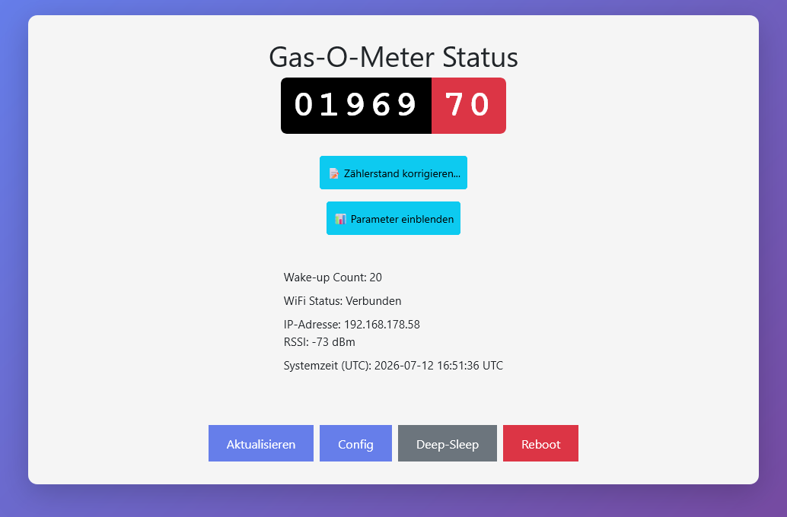
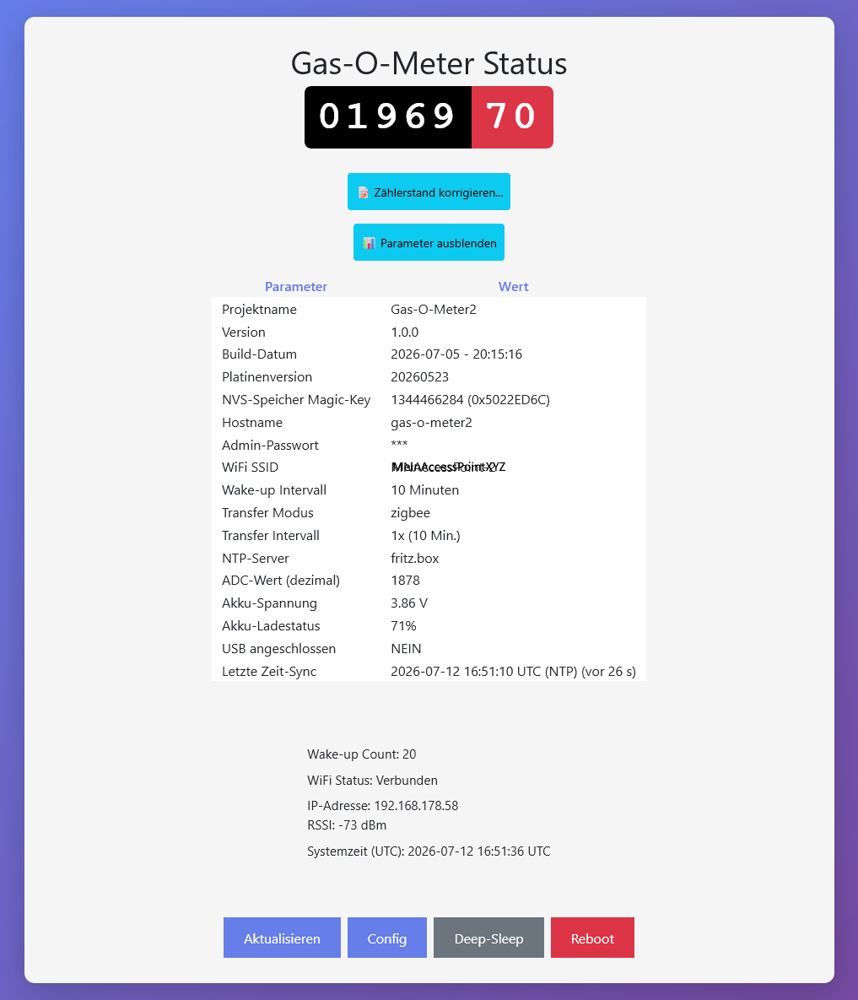
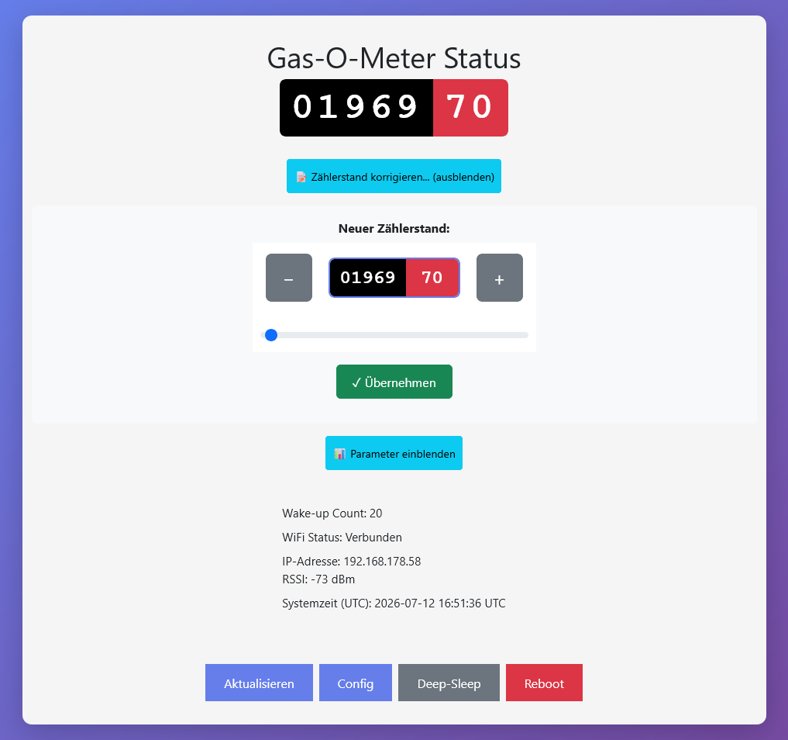
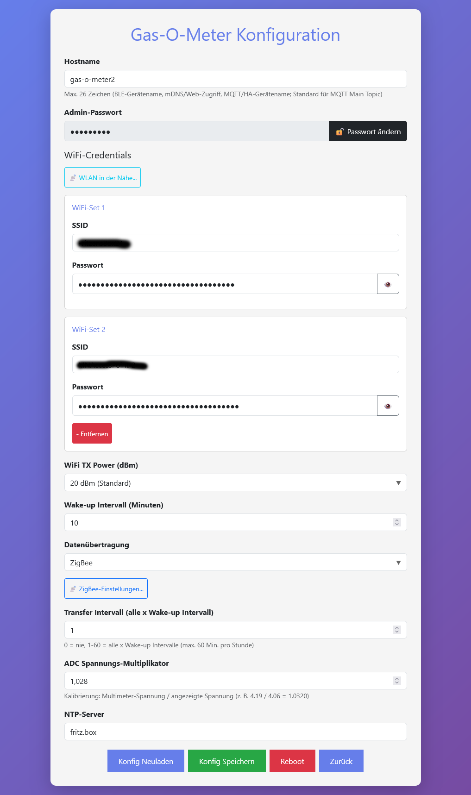
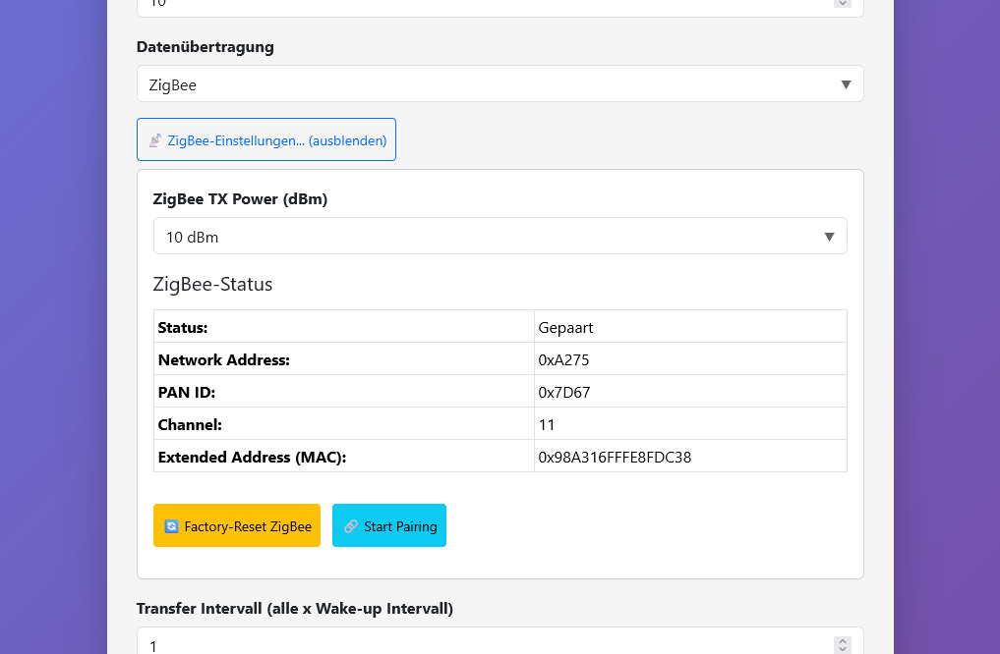
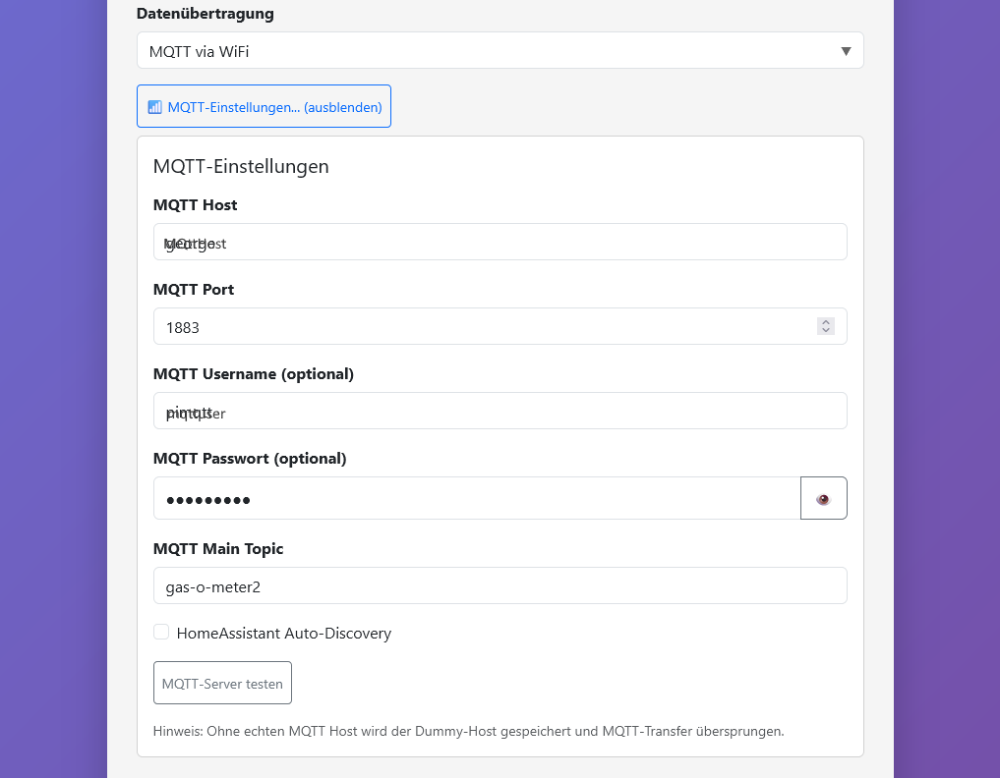

# Web-UI (Gas-O-Meter2)

Das Gerät stellt nach einem **manuellen Wake-up über Taster A** ein kleines HTTP-Frontend bereit (LittleFS unter `data/`). Im **Timer-Dauerbetrieb** (Akku) wacht es nur kurz auf, überträgt ggf. Daten und geht wieder in Deep-Sleep — **ohne** Web-Server.

## Zugang und URLs

| Situation | URL | Basic Auth |
| --------- | --- | ---------- |
| Im Heim-WLAN (STA) | `http://<hostname>.local/` oder `http://<hostname>.local/` oder `http://<IP>/` | Status: nein, Config: ja |
| Einrichtungs-Hotspot (AP) | `http://10.0.0.1/` (Captive Portal) | Status: nein, Config: ja |

- **Hostname** kommt aus `config.json` (`hostname`, Standard in [`data/config.json_example`](data/config.json_example): `gas-o-meter2`).
- **mDNS** funktioniert im STA-Modus, wenn das Netzwerk `.local`-Namen auflöst.
- Im AP-Modus verbinden Sie sich mit dem offenen WLAN des Geräts (`Gas-O-Meter2` bzw. `<hostname>`) und öffnen die Seite über `10.0.0.1`.

### Basic Auth für `/config`

Die Konfigurationsseite ist geschützt:

- **Benutzername:** immer `admin`
- **Passwort:** Wert von `adminpass` in `config.json` (bei Erstinstallation z. B. `AdminPasswort` aus dem Beispiel)

Der Browser fragt beim ersten Aufruf von `/config` nach diesen Zugangsdaten.

## Web-Timeout (Deep-Sleep)

Solange die Web-UI aktiv ist, bleibt das Gerät wach. Nach **5 Minuten** ohne Web-Server-Zugriff geht es automatisch in Deep-Sleep (`WIFI_WAIT_FOR_SLEEP` in [`include/hardware.h`](include/hardware.h)). Die Config-Seite sendet jedoch alle 2 Minuten einen Ping, um die Session aktiv zu halten.

## Status-Seite (`/`)

Die Startseite zeigt den **Zählerstand** (LP-Core-Pulse), Systeminfos und Aktionsbuttons:

- **Aktualisieren** — Seite neu laden
- **Config** — zur Konfiguration (Basic Auth)
- **Deep-Sleep** — Gerät sofort in Deep-Sleep schicken
- **Reboot** — Neustart

### Parameter-Tabelle

Über **Parameter einblenden** erscheinen Firmware-Version, Platinenversion, WiFi-SSID, Transfer-Modus, Akkuspannung, USB-Status, Zeit-Sync und weitere Werte. Das Admin-Passwort wird nur als `***` angezeigt.

### Zählerstand korrigieren

Mit **Zählerstand korrigieren** lässt sich der Anzeigewert per Slider oder +/- an den realen Gaszähler anpassen. **Übernehmen** speichert den Wert (NVS/RTC).

## Konfigurationsseite (`/config`)

Die Konfigurationsseite ist geschützt (Browser-Abfrage):

- **Benutzername:** immer `admin`
- **Passwort:** Wert von `adminpass` in `config.json` (bei Erstinstallation z. B. `AdminPasswort` aus dem Beispiel)

Wichtige Bereiche:

| Bereich | Inhalt |
| ------- | ------ |
| Gerät | Hostname, Admin-Passwort ändern |
| WiFi-Credentials | Bis zu 2 Netze, Scan **WLAN in der Nähe**, TX-Power |
| Timing | Wake-up-Intervall (`wakeup_minutes`) |
| Transfer | Modus `none` / `mqtt` / `ble` / `zigbee`, Intervall, ADC-Multiplikator, NTP |
| Aktionen | **Konfig Neuladen**, **Konfig Speichern**, **Reboot**, **Zurück** |

Nach **Konfig Speichern** wird `config.json` auf LittleFS geschrieben; ein **Reboot** übernimmt viele Einstellungen vollständig.

### ZigBee-Einstellungen

Wenn `transfer_mode` **zigbee** ist und gespeichert wurde, erscheint das Panel **ZigBee-Einstellungen** mit TX-Power und **ZigBee-Status** (Pairing, Netzwerkadresse). Pairing und Factory-Reset sind nur im **STA-Modus** (verbunden mit Ihrem WLAN) möglich, nicht im Einrichtungs-Hotspot.

### MQTT-Einstellungen

Bei gespeichertem Modus **mqtt** öffnet sich das Panel **MQTT-Einstellungen** (Host, Port, Zugangsdaten, Main Topic, Home Assistant Auto-Discovery, **MQTT-Server testen**). Der Screenshot zeigt **Beispielwerte**; auf dem Gerät stehen Ihre echten Einträge aus `config.json`.

MQTT-Test und -Transfer erfordern eine **STA-Verbindung** zum Heim-WLAN (nicht nur AP). Ohne echten MQTT-Host wird der Dummy-Host gespeichert und MQTT-Transfer übersprungen.

## Typische Workflows

### Erstinbetriebnahme

1. Gerät per **Taster A** wecken.
2. Mit dem Konfigurations-Hotspot verbinden oder — falls schon konfiguriert — `http://<hostname>.local/` öffnen.
3. Unter **Config** (`admin` + `adminpass`) WiFi-Daten eintragen und **Konfig Speichern**.
4. **Reboot**; danach im Heim-WLAN erneut die Status-Seite prüfen.

### Transfer-Modus wechseln

1. In **Datenübertragung** den gewünschten Modus wählen.
2. Modus-spezifisches Panel konfigurieren (sichtbar nur für den **gespeicherten** Modus; nach Dropdown-Änderung ohne Speichern bleiben Detail-Panels ausgeblendet).
3. **Konfig Speichern** und **Reboot**.

### Zählerstand an Gaszähler anpassen

1. Status-Seite öffnen.
2. **Zählerstand korrigieren**, Wert setzen, **Übernehmen**.

### ZigBee koppeln

1. `transfer_mode`: `zigbee`, speichern, reboot.
2. Im Heim-WLAN Config öffnen, **ZigBee-Einstellungen** aufklappen.
3. Pairing über Zigbee2MQTT / Coordinator starten; Status in der Tabelle prüfen.

Details zur Integration: [integration_templates/zigbee2mqtt/README.md](integration_templates/zigbee2mqtt/README.md)

## Grenzen und Hinweise

- Web-UI nur nach **Taster-A-Wake-up**, nicht bei reinem Timer-Wake-up im Akkubetrieb.
- **ZigBee** und **MQTT** (inkl. Test) benötigen **WiFi STA**; im AP-Modus nur Konfiguration, kein Pairing/Transfer.
- Passwörter (WLAN, MQTT, Admin) werden in `config.json` im Klartext gespeichert — LittleFS nur im lokalen Netz erreichbar halten.
- Vollständige Config-Keys: [`data/config.json_example`](data/config.json_example) und Abschnitt **Konfiguration** in [README.md](README.md).
