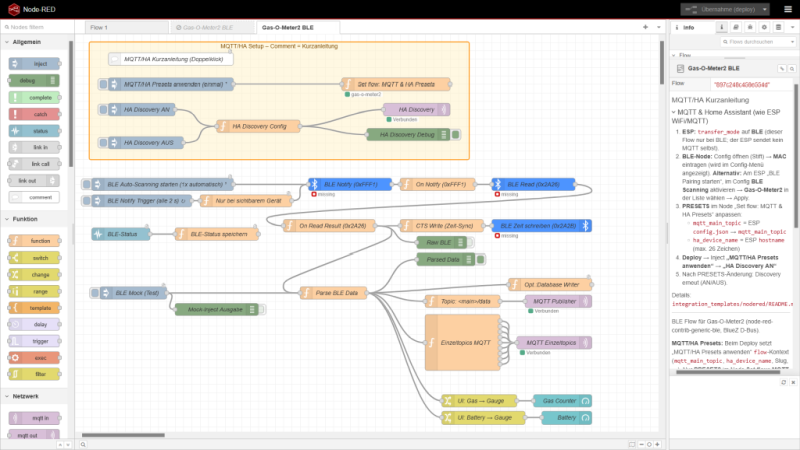

<!-- translation-source: README.md -->
<!-- translation-source-blob: ecb3cbf2889b34609b8f58106e2a631507cf84a0 -->

[↓ Wechsel zu Deutsch](README.md)

# Node-RED BLE Integration – Gas-O-Meter2

Node-RED flow templates for BLE connectivity with Gas-O-Meter2: receive measurement data (meter reading, battery, firmware) and a return path to the device for date/time sync via GATT write (0x2A2B).

[](nodered.png)

---

## 1. Prerequisites (Linux/Debian)

### Install packages

```bash
sudo apt-get install bluetooth bluez libbluetooth-dev libudev-dev
```

### Check bluetoothd

`bluetoothd` **must be running** – `node-red-contrib-generic-ble` uses the BlueZ D-Bus API.

```bash
sudo systemctl status bluetooth
sudo systemctl enable bluetooth
```

### Permissions

The Node-RED user must be in the `bluetooth` group:

```bash
sudo usermod -aG bluetooth <node-red-user>
```

Then log in again or restart Node-RED.

### Check BLE adapter

```bash
bluetoothctl
# In bluetoothctl:
power on
scan on
```

BLE devices should appear. Exit with `scan off` and `exit`.

**Important:** `hcitool lescan` does **not** work reliably with many BLE dongles (e.g. CSR 0a12:0001). `bluetoothctl` uses the current BlueZ stack and is the recommended test.

### Proxmox VM (USB passthrough)

If Node-RED runs in a Proxmox VM, pass through the USB BLE dongle:

```bash
# Auf dem Proxmox-Host:
qm set <VM-ID> -usb0 host=0a12:0001
```

Check in the VM: `lsusb` should show the dongle.

---

## 2. Install Node-RED package

**Package:** `node-red-contrib-generic-ble` (BlueZ D-Bus API)

**Interactive (recommended):**

1. Node-RED UI → Menu (☰) → Manage palette → Install
2. Search "generic ble" → `node-red-contrib-generic-ble` → Install
3. Restart Node-RED

**Command line:**

```bash
cd ~/.node-red
npm install node-red-contrib-generic-ble
```

Restart Node-RED.

**npm warnings:** Deprecation warnings from transitive dependencies (inflight, npmlog, rimraf, etc.) are normal and do not block installation.

---

## 3. Initial setup (BLE pairing)

One-time setup to connect Node-RED to Gas-O-Meter2. This is **not** real BLE pairing (no key exchange, no encryption) — only the MAC address is stored in the config node.

### Step by step

**ESP32C6 side:**

1. Open the Gas-O-Meter2 web frontend (config.html)
2. Set transfer mode to **"BLE"**
3. Click button **"BLE Pairing starten"**
4. ESP32C6 starts BLE advertising (90 second timeout)

**Node-RED side:**
5. Open the Generic BLE config node (pencil icon on the BLE node)
6. Enable **"BLE Scanning"** → Gas-O-Meter2 appears in the dropdown
7. Select the device → **Apply** → MAC address is saved
8. **Done** → **Deploy**

### Afterwards

- Advertising ends automatically; setup is complete.
- On every wake-up, Node-RED connects automatically using the stored MAC.
- **Repeat** only for a new ESP32C6 or a changed MAC.

**Important:** **"BLE Scanning" must stay enabled permanently in the Generic BLE config.** Only then can Node-RED find the device on each wake-up and establish a connection. If “BLE Scanning” is disabled, the node may still show “disconnected” (when the device is seen elsewhere) but will not connect — the ESP32 then hits the 90 s advertising timeout (“Keine BLE-Verbindung in 90 s”).

---

## 4. Install the flow

1. Node-RED UI → Menu (☰) → Import
2. Select `gas-o-meter2-ble-flow.json`
3. Open **Generic BLE Config** → enable BLE Scanning → select Gas-O-Meter2 → Apply
4. Configure the MQTT broker (if used)
5. **MQTT/HA:** At the top of the flow, the orange **Group „MQTT/HA Setup – Comment = Kurzanleitung“** with **„MQTT/HA Kurzanleitung (Doppelklick)“**. Alternatively: open tab **ℹ️** (Gas-O-Meter2 BLE). **„Set flow: MQTT & HA Presets“** → adjust only **`PRESETS`**. After deploy: **„MQTT/HA Presets anwenden (einmal)“** → **„HA Discovery AN“** (see **Configuration: PRESETS & HA**).
6. Deploy

All BLE nodes (“BLE Notify (0xFFF1)”, “BLE Read (0x2A26)”, “BLE Zeit schreiben (0x2A2B)”) use the **same** Generic BLE config (same MAC).

**ESP32 timing:** Wait 90 s for a connection → after connect, 3 s delay (`BLE_NOTIFY_DELAY_MS`), then one notify on 0xFFF1 → session up to 180 s. Time sync (write 0x2A2B) runs after the notify within that session.

**Test without hardware:** The inject node “BLE Mock (Test)” sends mock data straight into the pipeline (Parse BLE Data → MQTT/Debug) — no ESP32 required.

---

## 5. Flow overview and functions

### Sequence (simplified)

1. **On deploy – automatic, no click:** The inject **„BLE Auto-Scanning starten (1x automatisch)“** fires **once** about 0.5 s after each deploy (superscript **1** = “Inject once after deploy”). It sends `scanStart` to **„BLE Notify (0xFFF1)“** and starts BLE scanning — **you do not need to click the node manually.**
2. **Every 2 s:** **„BLE Notify Trigger (alle 2 s)“** → **„Nur bei sichtbarem Gerät“** sends either **Connect** or **Subscribe 0xFFF1** to **„BLE Notify (0xFFF1)“** depending on status (see BLE status handling).
3. **On notify:** **„BLE Notify (0xFFF1)“** delivers measurement data → **„On Notify (0xFFF1)“** stores the message and triggers a read 0x2A26 → **„BLE Read (0x2A26)“** → **„On Read Result (0x2A26)“** attaches the firmware and forwards to **„Parse BLE Data“**, **„Raw BLE“**, and **„CTS Write (Zeit-Sync)“** (**„BLE Zeit schreiben (0x2A2B)“**).
4. **„Parse BLE Data“** builds the unified payload (gas, battery, …) → **„MQTT Publisher“** / **„Einzeltopics MQTT“**, dashboard, optional HA Discovery.

### MQTT topics

**Naming scheme** (like `transfer_mqtt.cpp`, values from **`PRESETS`**):

- Live data: `<mqtt_main_topic>/data`, `<mqtt_main_topic>/gas`, … and `<mqtt_main_topic>/status`
- HA Discovery: `homeassistant/<typ>/gas_o_meter2_<slug>_<name>/config` — the slug comes from `mqtt_main_topic` (`/` and `-` → `_`)

**What goes where?** Over BLE the ESP only provides meter reading and battery (`0xFFF1`). **Node-RED** writes the rest to MQTT so Home Assistant finds the same entities as with direct ESP MQTT:

| MQTT-Topic (Auszug) | Quelle im BLE-Flow |
| ------------------- | ------------------ |
| `…/gas`, `…/battery`, `…/battery_voltage`, `…/battery_low` | aus BLE-Notify → **„Parse BLE Data“** |
| `…/firmware_version` | GATT-Read **0x2A26** (nach jedem Notify) |
| `…/timestamp` | **Uhrzeit des Gateways** (ISO-UTC in **„Parse BLE Data“**), nicht vom ESP |
| `…/rssi` | fest **`0`** (wird per BLE nicht übertragen) |
| `…/ntp_status` | Unix-Epoch der zuletzt per **„CTS Write (Zeit-Sync)“** / **„BLE Zeit schreiben (0x2A2B)“** gesendeten Zeit (`flow.ble_time_sync_epoch`), sonst **`-1`** |
| `…/status` | **`online`** bei jedem erfolgreichen Durchlauf (**„Einzeltopics MQTT“**) |

**`ntp_status`** here means: “gateway last sent a UTC time to the ESP via BLE time write” (not NTP/WiFi on the ESP). **`timestamp`** remains the ISO time at parse time on the gateway.

### BLE status handling (fewer debug messages)

The library `node-red-contrib-generic-ble` throws **„Not yet connected“** when a **Subscribe** is triggered without an existing connection. To reduce these messages, the flow does the following:

- **„Nur bei sichtbarem Gerät“** (after **„BLE Notify Trigger (alle 2 s)“**):
  - Status **missing** → nothing is sent.
  - Status **disconnected** or **connecting** → only **Connect** is sent to **„BLE Notify (0xFFF1)“** (no Subscribe → no “Not yet connected”).
  - Status **connected** → **Subscribe 0xFFF1** is sent; the connection is already up, so Subscribe succeeds.

**„BLE-Status“** reads the current status from **„BLE Notify (0xFFF1)“**; **„BLE-Status speichern“** writes it to `flow.bleNotifyStatus`. **„Nur bei sichtbarem Gerät“** uses that to decide Connect vs Subscribe. This yields far fewer “Not yet connected” messages in debug.

### Firmware query (0x2A26)

The firmware version is in characteristic **0x2A26** (read only). The flow fetches it **after** every notify:

1. **„On Notify (0xFFF1)“:** Detects notify data (0xFFF1), stores the message in `flow.lastNotifyMsg`, and outputs `{ topic: '2a26' }`.
2. **„BLE Read (0x2A26)“:** Receives that message, performs the GATT read 0x2A26, and outputs the result.
3. **„On Read Result (0x2A26)“:** Reads the firmware string from the payload, retrieves the stored notify message, sets `msg.firmware`, and forwards to **„Parse BLE Data“**, **„Raw BLE“**, and **„CTS Write (Zeit-Sync)“**.

Parsed data and MQTT then show the real firmware version instead of “unknown”.

### Configuration: PRESETS & HA

| Was | Wo | Anpassen? |
| --- | --- | --- |
| **`mqtt_main_topic`** | Node **„Set flow: MQTT & HA Presets“** → `PRESETS` | Ja (= ESP `config.json` → `mqtt_main_topic`) |
| **`ha_device_name`** | Node **„Set flow: MQTT & HA Presets“** → `PRESETS` | Ja (= ESP `hostname`, max. 26 Zeichen) |
| **`HA_DEVICE_PREFIX`** (`gas_o_meter2`) | Function-Code in **„Set flow: MQTT & HA Presets“** und **„HA Discovery Config“** | Nein – wie `MQTT_HA_DEVICE_TOPIC_PREFIX` in `mqtt_config.h` |
| **`HA_MANUFACTURER`** / **`HA_MODEL`** | Function-Code in **„Set flow: MQTT & HA Presets“** und **„HA Discovery Config“** | Nein – wie `MQTT_HA_MANUFACTURER` / `MQTT_HA_MODEL` (Zigbee-Converter: `vendor`/`model`) |
| **`EXPIRE_AFTER_SEC`** (7200) | Function-Code in **„Set flow: MQTT & HA Presets“** und **„HA Discovery Config“** | Nein – wie `MQTT_HA_EXPIRE_AFTER_SEC` |

**Slug:** From `mqtt_main_topic`, `/`, `-`, and spaces become `_` (e.g. `gas-o-meter2` → `gas_o_meter2`).

**Steps after import or PRESETS change:**

1. ESP `transfer_mode` to **BLE**
2. **BLE node:** Generic BLE Config (pencil) → enter **MAC** (shown in the menu). **Alternatively:** ESP “BLE Pairing starten”, **BLE Scanning** on → select device → Apply (see **Initial setup**)
3. Set `PRESETS` → **Deploy**
4. Inject **„MQTT/HA Presets anwenden (einmal)“** (also runs once on deploy)
5. Inject **„HA Discovery AN“**
6. In HA: MQTT integration → reload devices

**Availability:** Same as the firmware: `availability_topic` = `<mqtt_main_topic>/status`, `payload_available` = `online`, `payload_not_available` = `offline`, `expire_after` = 7200. On every measurement the BLE flow sets **`…/status` = `online`** (retain). After successful MQTT the ESP firmware does **not** send an explicit `offline` (only LWT on failure).

**Migration:** Delete old discovery with a wrong `unique_id` (e.g. `…_gas` instead of `gas_o_meter2_<slug>_gas`) or without `expire_after`/`availability_topic` on the broker under `homeassistant/.../config`, then turn Discovery ON again.

**Voltage:** The ESP sends `bv` in **mV**; **„Parse BLE Data“** converts to **V** (same as ESP MQTT).

### Home Assistant Auto-Discovery

- **HA Discovery AN / AUS:** Two inject nodes enable or disable discovery (payload `true` / `false`).
- **„HA Discovery Config“:** Seven entities like `transfer_mqtt.cpp`: Gas, Battery, voltage (**V**), Battery Low (ON/OFF template), Firmware (`unique_id` tail `firmware`), RSSI, NTP status (`device_class: timestamp`, `as_datetime(value)`). Discovery topics: `homeassistant/<component>/gas_o_meter2_<slug>_<tail>/config`; **`unique_id`** = `gas_o_meter2_<slug>_<tail>`. Per entity: **`expire_after`**, **`availability_topic`** → `<mqtt_main_topic>/status`. After a **PRESETS** change: **„MQTT/HA Presets anwenden (einmal)“** → **„HA Discovery AN“** (optionally **„HA Discovery AUS“** first).
- **„HA Discovery“** (MQTT out): Sends retained QoS 1 configs to the broker.

After **„HA Discovery AN“**, entities appear in Home Assistant. Aggregated JSON via **„MQTT Publisher“** / **„Topic: `<main>/data`“**; individual topics via **„Einzeltopics MQTT“** → **„MQTT Einzeltopics“** including `<mqtt_main_topic>/status` = `online` on every BLE update.

---

## 6. Gas-O-Meter2 BLE characteristics

| UUID   | Bedeutung        | Lese/Schreib |
|--------|------------------|--------------|
| 0xFFF1 | Messdaten (JSON) | Read/Notify  |
| 0x2A26 | Firmware         | Read         |
| 0x2A2B | Current Time     | Read/Write   |

---

## 7. SBFspot coexistence

SBFspot (Classic Bluetooth, RFCOMM kernel sockets) and `node-red-contrib-generic-ble` (BLE, BlueZ D-Bus) can run **in parallel** on the same dual-mode adapter:

- SBFspot uses Classic BT via RFCOMM → kernel level
- generic-ble uses BLE via BlueZ D-Bus → userspace
- `bluetoothd` manages both → no conflict
- SBFspot cron jobs run independently of Node-RED

---

## 8. Troubleshooting

| Problem | Lösung |
| ------- | ------ |
| generic-ble findet keine Geräte | `bluetoothctl scan on` prüfen, ob BLE-Geräte sichtbar sind |
| "Permission denied" | User in Gruppe `bluetooth`? → `groups <user>` prüfen |
| bluetoothd läuft nicht | `sudo systemctl start bluetooth` |
| Dongle nicht sichtbar (Proxmox) | USB-Passthrough konfigurieren: `qm set <VM-ID> -usb0 host=...` |
| Deprecation-Warnings bei npm install | Normal (transitive Abhängigkeiten), blockiert nicht |
| **Node-RED stürzt ab:** `indexOf is not a function` in `PeripheralRemovableNoble.onMiss` | Siehe Abschnitt **8a** (Bug in node-red-contrib-generic-ble beim „device missed“). |

### 8a. Crash: `indexOf is not a function` (onMiss)

**Symptom:** Node-RED exits with  
`TypeError: this._discoveredPeripheralUUids.indexOf is not a function`  
in `node-red-contrib-generic-ble/dist/noble/index.js` (around line 61), triggered by `onDeviceMissed` (BlueZ reports the device as “missing”). Result: no message at “Raw BLE”, status jumps from “missing” to “disconnected”, service keeps restarting.

**Cause:** Package bug — on “device missed”, `.indexOf` is called on a variable that is not an array on this path.

**Workaround (manual patch in the package):**

1. Open the file (path depends on install, e.g.):

   ```text
   ~/.node-red/node_modules/node-red-contrib-generic-ble/dist/noble/index.js
   ```

2. In function `onMiss` (around line 61), find the line with `this._discoveredPeripheralUUids.indexOf`.
3. **Before** that, add a guard, e.g. at the start of the `onMiss` function:

   ```javascript
   if (!Array.isArray(this._discoveredPeripheralUUids)) {
       this._discoveredPeripheralUUids = [];
   }
   ```

4. Restart Node-RED.

**Permanent fix:** File an issue with the maintainer (GitHub: CANDY-LINE/node-red-contrib-generic-ble) or wait for a package update that initializes or checks `_discoveredPeripheralUUids` as an array on this path.

### 8b. “Disconnected” in Node-RED, but no debug output at “Raw BLE”

**Symptom:** In `bluetoothctl` the device appears (e.g. `[NEW] Device 98:A3:16:8F:D9:AA gas-o-meter2`), in Node-RED the BLE node shows “disconnected”, and the debug node **„Raw BLE“** produces no message.

**Explanation:** In many cases this is **expected behavior**:

- **„Raw BLE“** only shows **received notify data** (payload on characteristic 0xFFF1). It gets **no** messages on connect or disconnect — only when the ESP32 actually sends a notify.
- **„disconnected“** is the node **status** (connected/disconnected). If the device is only briefly visible and disappears (“device missed”), or the connection drops **before** the ESP32 sends data, status stays “disconnected” and **no** message reaches “Raw BLE”.

**Typical scenarios:**

| Situation | bluetoothctl | Node-RED Status | Raw BLE |
| --------- | ------------- | --------------- | ------- |
| Gerät sendet Werte (Wake-up, Notify) | Gerät sichtbar, ggf. verbunden | connected → danach disconnected | **Ja** (einmal pro Notify) |
| Gerät nur sichtbar, sendet nicht | NEW Device, RSSI-Updates | disconnected | **Nein** |
| Verbindung bricht vor dem ersten Notify ab | – | disconnected | **Nein** |

**What to check:**

1. **Enable „Raw BLE“:** In the flow, right-click the “Raw BLE” debug node → **Enable** (or double-click → check “Enable”), then Deploy. Without enabling it, nothing appears there.
2. **ESP32 actually sends:** Gas-O-Meter2 only sends once on wake-up (e.g. button press or periodically) via 0xFFF1. Only then should “Raw BLE” get a message.
3. **Timing:** If the ESP32 goes back to sleep quickly or the connection drops before the first notify, you see “disconnected” with no Raw BLE output.

In short: **Raw BLE = received payload only.** Status “disconnected” without Raw BLE output usually means: no notify has arrived (yet).

### 8c. “Missing → Disconnected → Missing”, but no data (no crash)

**Symptom:** Node-RED shows the Missing → Disconnected → Missing cycle but no longer crashes. Still no values at “Raw BLE” or in the flow.

**Cause:** The ESP32 sent the notify **immediately** after connect. The central (Node-RED/generic-ble) needs a few seconds for service discovery and subscribing to characteristic 0xFFF1. If the notify arrives before the subscription, the message is lost.

**Fix (ESP32 firmware):** From a certain firmware version, the ESP32 waits **3 seconds** after connect (`BLE_NOTIFY_DELAY_MS` in `include/ble_config.h`) before sending the first notify. Flash the latest firmware. If a slow system (e.g. weak VM) still gets no data, raise `BLE_NOTIFY_DELAY_MS` to 5000.

---

## Notes

- BLE becomes active only when transfer mode **BLE** is enabled on the ESP32C6.
- generic-ble uses BlueZ D-Bus — **bluetoothd** must be running (do not stop it).
